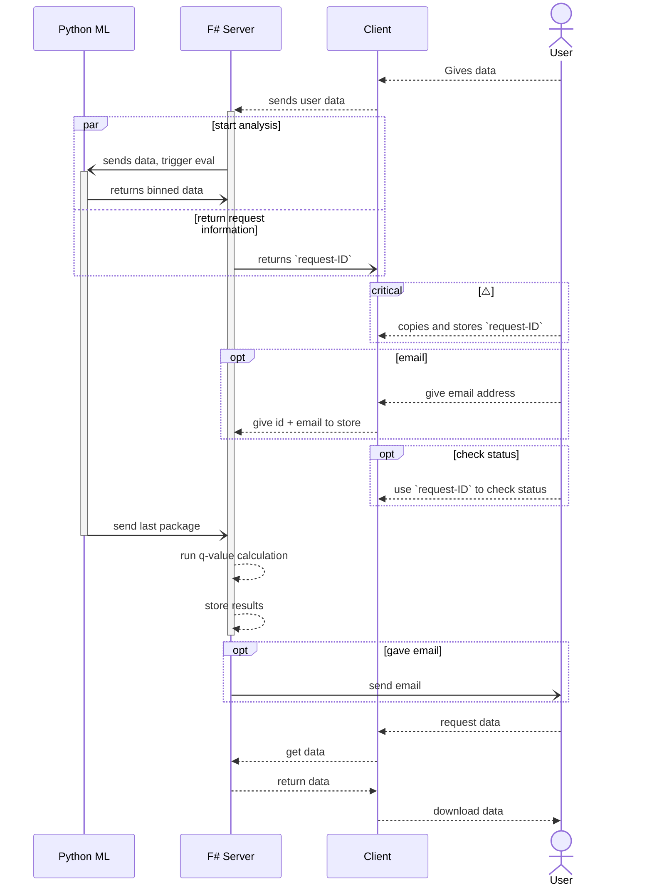

# SAFE Template

## Install pre-requisites

You'll need to install the following pre-requisites in order to build SAFE applications

* [.NET SDK](https://www.microsoft.com/net/download) 8.0 or higher
* [Node 18](https://nodejs.org/en/download/) or higher
* [NPM 9](https://www.npmjs.com/package/npm) or higher

## Starting the application

## Request Workflow

