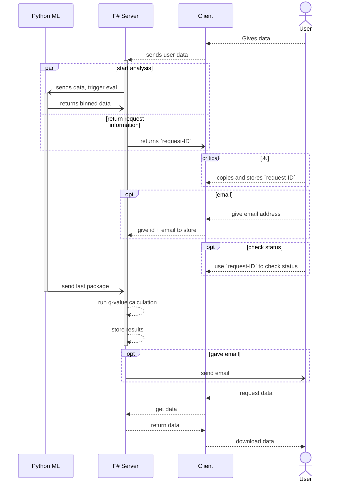

# PySAFE

# Result

Explanations of Chloropred ,Qchloro, Mitopred,Qmito,Secrpred,Qsecr, and FinalPred.

### Chloropred

Prediction score indicating the likelihood of the protein being localized to the Chloroplast. A higher scores suggest a stronger prediction that the protein is localized in the Chloroplast.

### Qchloro

q-value associated with the Chloroplast prediction score. Provides a measure of statistical significance for the Chloroplast prediction. Lower q-values indicate higher statistical significance.

### Mitopred
Prediction score for the localization of the protein to the Mitochondria. A higher scores suggest a stronger prediction of Mitochondrial localization.

### Qmito
q-value associated with the Mitochondria prediction score. Indicates the statistical significance of the Mitochondria localization prediction. Lower q-values suggest a more reliable prediction.

### Secrpred
Prediction score for identifying the protein as a Secretory Protein.A higher scores indicate a stronger likelihood that the protein functions as a Secretory Protein.

### Qsecr
q-value for the Secretory Protein prediction. Provides a measure of the statistical significance of the Secretory Protein prediction. Lower q-values are indicative of more statistically significant predictions.

### FinalPred
Represents the model's final prediction of the protein's localization based on the highest score and its corresponding q-value. The final localization is determined by comparing the q-values and prediction scores against preset cutoffs. If all q-values exceed the cutoff, the protein is classified as "Cytoplasmic."

### Cutoff
The threshold q-value below which a prediction is considered statistically significant. Set to 0.05 by default, meaning that predictions with q-values below this threshold are classified as significant. This parameter helps in distinguishing between statistically significant and non-significant predictions, reducing the chance of false-positive localizations.

# Local Development

## Install pre-requisites

You'll need to install the following pre-requisites in order to build SAFE applications

* [.NET SDK](https://www.microsoft.com/net/download) 8.0 or higher
* [Node 18](https://nodejs.org/en/download/) or higher
* [NPM 9](https://www.npmjs.com/package/npm) or higher

## Starting the application

## Request Workflow

### Development

1a. Settings:
    - Cutoff in settings: default value of 0.05
1b. User input:
    - main.py: 31-41
    - Recylce Deepstabp parsing
    - No letter swapping, no whitespace in between.
2. Run prediction on `list[PredictorInfor]`
    - Output: `list[SinglePrediction]`
3. Run statistics on `SinglePrediction list`
    - Requires cut-off value to make final prediction.
    - offer download as csv, tsv or xlsx
